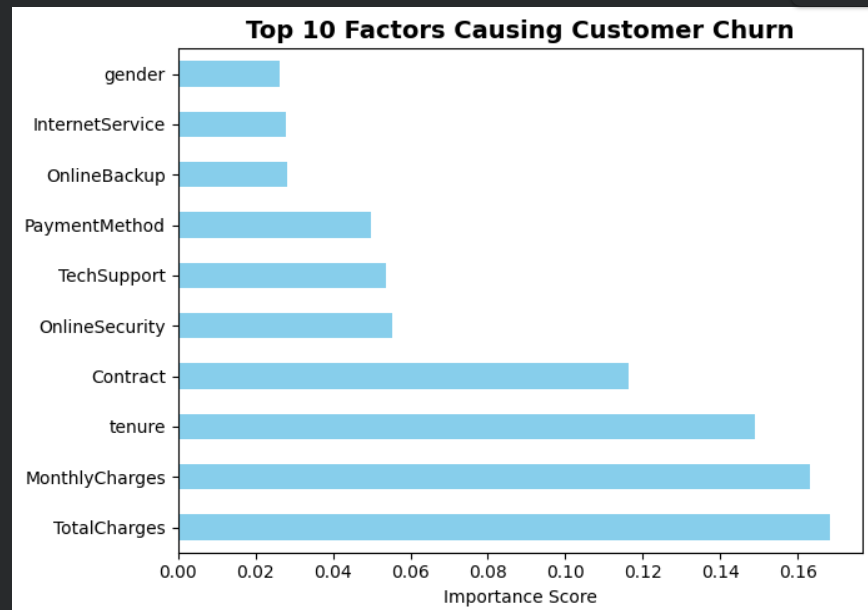
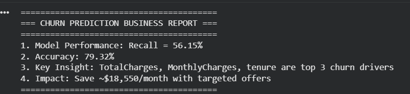

# Customer Churn Prediction 📊

**Problem:** Telecom companies lose ~26% customers yearly
**Solution:** ML model using Python + Scikit-learn with 56% recall

**Key Insights:**
1. Top 3 churn drivers: TotalCharges, MonthlyCharges, tenure
2. Business Impact: Save ~$18,550/month with targeted retention

